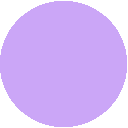

<table>
  <tr>
    <td>
      <!-- Mocha Palette Table -->
      🌿 Mocha
      <table>
        <tr>
          <th></th>
          <th>Labels</th>
          <th>Hex</th>
          <th>RGB</th>
          <th>HSL</th>
        </tr>
        <tr>
          <td></td>
          <td>Rosewater</td>
          <td><code>#f4dbd6</code></td>
          <td><code>rgb(244, 219, 214)</code></td>
          <td><code>hsl(10, 58%, 90%)</code></td>
        </tr>
        <tr>
          <td></td>
          <td>Flamingo</td>
          <td><code>#f0c6c6</code></td>
          <td><code>rgb(240, 198, 198)</code></td>
          <td><code>hsl(0, 58%, 86%)</code></td>
        </tr>
        <tr>
          <td></td>
          <td>Pink</td>
          <td><code>#f5bde6</code></td>
          <td><code>rgb(245, 189, 230)</code></td>
          <td><code>hsl(316, 74%, 85%)</code></td>
        </tr>
        <tr>
          <td></td>
          <td>Mauve</td>
          <td><code>#c6a0f6</code></td>
          <td><code>rgb(198, 160, 246)</code></td>
          <td><code>hsl(267, 83%, 80%)</code></td>
        </tr>
        <tr>
          <td></td>
          <td>Red</td>
          <td><code>#ed8796</code></td>
          <td><code>rgb(237, 135, 150)</code></td>
          <td><code>hsl(351, 74%, 73%)</code></td>
        </tr>
        <tr>
          <td></td>
          <td>Maroon</td>
          <td><code>#ee99a0</code></td>
          <td><code>rgb(238, 153, 160)</code></td>
          <td><code>hsl(355, 68%, 77%)</code></td>
        </tr>
        <!-- Add more rows for Mocha colors -->
      </table>
    </td>
    <td>
      <!-- Macchiato Palette Table -->
      🌺 Macchiato
      <table>
        <tr>
          <th></th>
          <th>Labels</th>
          <th>Hex</th>
          <th>RGB</th>
          <th>HSL</th>
        </tr>
        <tr>
          <td></td>
          <td>Rosewater</td>
          <td><code>#f4dbd6</code></td>
          <td><code>rgb(244, 219, 214)</code></td>
          <td><code>hsl(10, 58%, 90%)</code></td>
        </tr>
        <tr>
          <td></td>
          <td>Flamingo</td>
          <td><code>#f0c6c6</code></td>
          <td><code>rgb(240, 198, 198)</code></td>
          <td><code>hsl(0, 58%, 86%)</code></td>
        </tr>
        <tr>
          <td></td>
          <td>Pink</td>
          <td><code>#f5bde6</code></td>
          <td><code>rgb(245, 189, 230)</code></td>
          <td><code>hsl(316, 74%, 85%)</code></td>
        </tr>
        <tr>
          <td></td>
          <td>Mauve</td>
          <td><code>#c6a0f6</code></td>
          <td><code>rgb(198, 160, 246)</code></td>
          <td><code>hsl(267, 83%, 80%)</code></td>
        </tr>
        <tr>
          <td></td>
          <td>Red</td>
          <td><code>#ed8796</code></td>
          <td><code>rgb(237, 135, 150)</code></td>
          <td><code>hsl(351, 74%, 73%)</code></td>
        </tr>
        <tr>
          <td></td>
          <td>Maroon</td>
          <td><code>#ee99a0</code></td>
          <td><code>rgb(238, 153, 160)</code></td>
          <td><code>hsl(355, 68%, 77%)</code></td>
        </tr>
        <!-- Add more rows for Macchiato colors -->
      </table>
    </td>
  </tr>
</table>
